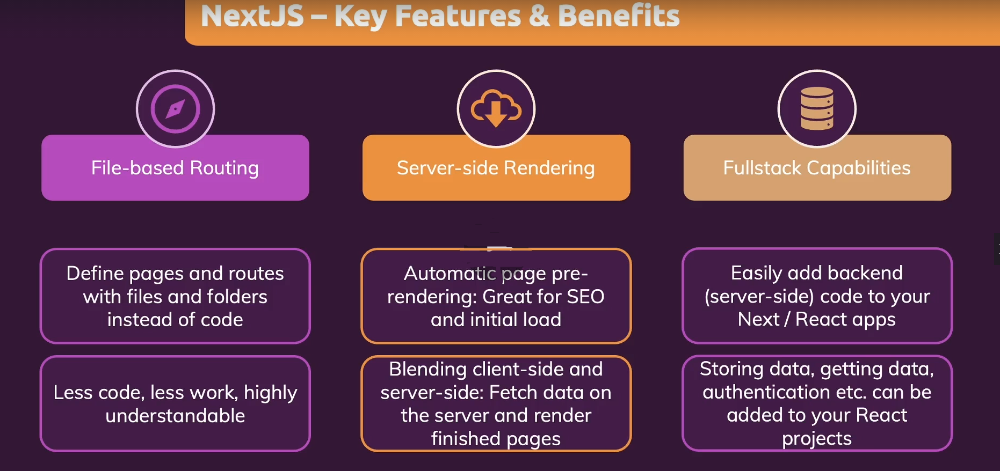
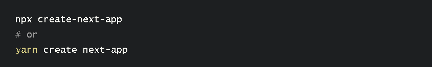

<h3>
  
  Next:
</h3>

# Особенности 
Основные преимущетсва next js:
- pre render на стороне сервера. Реакт дает нам пустой html код, что плохо для поисковых роботов. Благодаря прирендеру на стороне сервера мы можем этого избежать.
- routing позвозяет переходить между ссылками внутри сайта, создавая иллюзию многостраничного сайта не смотря на то что это SPA
- Возможность писать бэкэнд внутри одного проекта 

 # Как создать next.js приложение 

 - Установить node js
 - прописать команду 
 
      <npx create-next-app>

- прописать команду npm install для установки всех покетов

      <npm install> 

